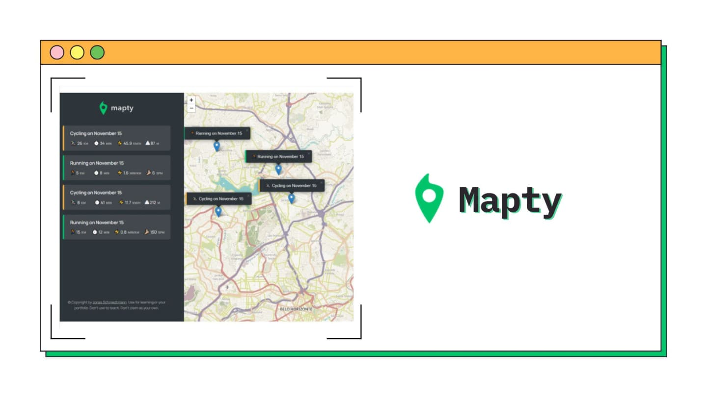

<h1 align="center">Mapty
</h1>

&nbsp;



<h2 align="center"> 
	🚧 Mapty 🟢 Completed 🚀 🚧
  
</h2>

&nbsp;

<!--
## Table of contents

- [Project description](#description) - [What I learned](#What-I-learned) -->

<h2 id="#description">Project description 📚</h2>

This project was developed in Jonas Schmedtmann's JavaScript course, where OOP, Geolocalization API, leaflet js and localStorage were used.

<h3>Project's goal:</h3>

The user can add the workouts after selecting the workout location on the map. Only running and cycling workouts are allowed


&nbsp;

## What I learned

<h3>The basics to plan a WEB project.</h3>

1. USER STORIES - Description of the application's functionality from the user's perspective.

2. FEATURES - The features that I will implement according to user stories

3. FLOWCHART - Flowchart of what will be implemented in the project

&nbsp;


<h3><strong>OOP (Object-Oriented Programming)</strong></h3> - In this project I used OOP to organize my code structure, with classes, objects, inheritance and methods according to architecture.

&nbsp;


<h3><strong>Geolocation API</strong></h3> - to find user's location

&nbsp;

```js
...
 navigator.geolocation.getCurrentPosition(this._loadMap.bind(this), () => {
        alert('Could not get your position');
      });
```

<h3><strong>leaflet js</strong> </h3> to show the application map and from that the user will be able to mark the training, documentation of this library <a href="https://leafletjs.com">leafletjs</a>

&nbsp;

```js
this.#map = L.map('map').setView(coords, this.#mapZoomLevel);

L.tileLayer('https://{s}.tile.openstreetmap.fr/hot/{z}/{x}/{y}.png', {
  attribution:
    '&copy; <a href="https://www.openstreetmap.org/copyright">OpenStreetMap</a> contributors',
}).addTo(this.#map);
```

<h3><strong>localStorage</strong> </h3> - was also used to store the client's workouts in the browser, so even if the user reloads the page, the workouts will be saved

&nbsp;

```js
localStorage.setItem('workouts', JSON.stringify(this.#workout));
```

## Links

- [Preview Site](https://vinicius-mapty.netlify.app)
<!-- - [Frontend Mentor Solution Page](https://www.frontendmentor.io/solutions/challenge-completed-with-htmlcssleaflet-jsgrid-and-responsive--kw3kKedNp) -->

&nbsp;

## My process

### Built with

- [HTML](https://developer.mozilla.org/en-US/docs/Web/HTML)
- [CSS](https://developer.mozilla.org/en-US/docs/Web/CSS)
- [Vanilla js](http://vanilla-js.com)
- [OOP with JavaScript](https://developer.mozilla.org/en-US/docs/Learn/JavaScript/Objects)
- [leaflet js](https://leafletjs.com)
- [API geolocalization](https://developer.mozilla.org/en-US/docs/Web/API/Geolocation)
- [LocalStorage](https://developer.mozilla.org/en-US/docs/Web/API/Window/localStorage)

&nbsp;

## 👨‍💻 Author

- [Frontend Mentor](https://www.frontendmentor.io/profile/viniciusshenri96)
- [Linkedin](https://www.linkedin.com/in/vinícius-henrique-7a2533229/)
